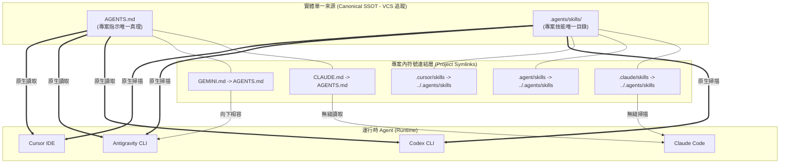

# 跨 Agent 單一真理來源（SSOT）整合架構與 dhpk 改版規格書

| 欄位 | 值 |
| --- | --- |
| `owner` | `tooling-owner` |
| `status` | `proposed` |
| `last-verified` | `2026-09-24` |
| `canonical-source` | 本文件 |

本文件定義專案內多 AI Agent 工具（Claude Code、OpenAI Codex CLI、Google Antigravity CLI、Cursor IDE）之**專案指引（Instructions）**與**擴充技能（Skills）**的單一真理來源（Single Source of Truth, SSOT）整合架構，並作為 **`dhpk`（Developer Harness Package / Plugin System）改版**之工程實作規範。

---

## 1. 背景與核心問題（Problem Statement）

在多 Agent 協同開發環境下，由於各大工具初期各自發展規範，導致專案配置出現嚴重的「碎片化」與「狀態漂移（Drift）」：

1. **專案指示檔多頭馬車**：
   - 專案根目錄同時存在 `AGENTS.md`、外部 symlink 之 `CLAUDE.md` 及 `GEMINI.md`。
   - Claude Code 預設優先讀取 `CLAUDE.md`，而 Codex / Antigravity / Cursor 讀取 `AGENTS.md`。當兩者內容分歧時，不同 Agent 會獲取矛盾的架構約束與執行策略。
2. **技能目錄散落各處且內容分歧**：
   - 專案內目前同時存在 `.agents/skills/`（21 個技能）、`.claude/skills/`（24 個技能）、`.cursor/skills/`（60+ 個技能）。
   - 經靜態比對，相同名稱之技能（如 10 個 `openspec-*` 技能）之 `SKILL.md` 內容已產生文本漂移（如指令提示符號不一致）；部分專案專屬技能（如 `zdpos-anchor-review`、`bug-investigation`）僅存在於特定目錄，其他 Agent 無法調用。
3. **維護成本倍增**：
   - 每次新增或更新技能，若無單一來源，必須手動同步至 3~4 個目錄，極易遺漏。

---

## 2. 官方規格查核與支援矩陣（2026-09 最新驗證）

經針對各 Agent 官方文檔查核與本機安裝環境（`claude 2.1.281`、`codex 0.156.1`、`agy 1.2.9`、`cursor 3.15.19`）實測，各大工具對開放標準之支援度已全面成熟：

| Agent / 工具 | 專案指示檔 (Instructions) | 專案技能目錄 (Project Skills) | 全域技能目錄 (Global Skills) | 官方行為與機制解析 |
| :--- | :--- | :--- | :--- | :--- |
| **Claude Code**<br>(`claude`) | **原生支援 `AGENTS.md`**<br>(相容 `CLAUDE.md`) | `.claude/skills/` | `~/.claude/skills/` | 自 `v2.1.277` (2026-09-18) 起正式原生支援 `AGENTS.md`。<br>⚠️ **Fallback 機制**：若專案中存在 `CLAUDE.md` 則優先讀取；**若無 `CLAUDE.md` 則自動讀取 `AGENTS.md`**。採用 Agent Skills RFC 標準格式。 |
| **Codex CLI**<br>(`codex`) | **原生以 `AGENTS.md` 為第一公民** | **`.agents/skills/`** | `~/.codex/skills/` | 由 Agentic AI Foundation 推動，標準指示檔唯一原生認可 `AGENTS.md`；專案技能探索目錄原生即為 `.agents/skills/`。 |
| **Antigravity**<br>(`agy`) | **原生支援 `AGENTS.md`**<br>(亦支援 `GEMINI.md`) | **`.agents/skills/`**<br>(亦相容 `.agent/skills/`) | `~/.gemini/config/skills/` | 階層式向上探索專案目錄的 `AGENTS.md` 與 `GEMINI.md`；技能自動探索 `.agents/` 或 `.agent/` 下之 `skills/`。 |
| **Cursor IDE**<br>(`cursor`) | **原生支援 `AGENTS.md`**<br>(相容 `.cursorrules` / `.mdc`) | **原生多目錄自動探索**：<br>1. `.agents/skills/`<br>2. `.cursor/skills/`<br>3. `.claude/skills/`<br>4. `.codex/skills/` | `~/.cursor/skills/`<br>`~/.agents/skills/`<br>`~/.claude/skills/`<br>`~/.codex/skills/` | Cursor 原生辨識根目錄之 `AGENTS.md` 作為通用跨工具指引；技能探索機制極具相容性，會自動掃描上述所有目錄。 |

### 核心結論
所有 Agent **均已原生支援 `AGENTS.md`**，且在技能規格上皆採納相同的 **Agent Skills 開放標準（資料夾內置 `SKILL.md`）**。差異僅在於 Claude Code 的本機技能目錄限制在 `.claude/skills/`，其餘工具（Codex、Antigravity、Cursor）皆已原生認可 **`.agents/skills/`**。

---

## 3. 單一真理來源（SSOT）整合架構

### 3.1 實體與軟連結拓撲圖



### 3.2 規則層設計（Instruction SSOT）
*   **唯一專案指引檔案**：`AGENTS.md`（位於專案根目錄）。
*   **唯一程式碼標準檔案**：`CODING_STANDARDS.md`（位於專案根目錄，整合 PHP 5.6 語言限制、短陣列、框架存取、魔術值與命名規範，取代零散之 `coding-style.md`）。
*   **映射方針**：
    *   `CLAUDE.md -> AGENTS.md`（相對路徑軟連結）。
    *   `GEMINI.md -> AGENTS.md`（相對路徑軟連結）。
    *   `.claude/rules/php/coding-style.md` $\to$ 指針導向專案根目錄 `CODING_STANDARDS.md`。

### 3.3 技能層設計（Skills SSOT）
*   **唯一實體目錄**：`.agents/skills/`（位於專案根目錄）。
    *   *選定 `.agents/skills/` 的架構理由*：
        1. **Codex CLI 原生標準**：Codex 只掃描 `.agents/skills/`，無法設定別名目錄。
        2. **Antigravity 原生支援**：`agy` 內建探索 `.agents/skills/`。
        3. **Cursor 原生支援**：Cursor 自動探索清單優先包含 `.agents/skills/`。
        4. **行業開放標準**：符合 Agentic AI Foundation / Linux Foundation 的規範命名。
*   **映射方針**：
    *   `.claude/skills` $\to$ 指向 `../.agents/skills` 的軟連結。
    *   `.agent/skills` $\to$ 指向 `../.agents/skills` 的軟連結。
    *   `.cursor/skills` $\to$ 指向 `../.agents/skills` 的軟連結（或依專案需要移除實體目錄，Cursor 本身即可探索 `.agents/skills`，但保留 symlink 可確保 100% 透明相容）。

### 3.4 子資料夾階層式設計（Hierarchical Subdirectory SSOT）
專案內部包含各層級與架構邊界的子資料夾（如 `domain/`、`infrastructure/`、`js/`、`protected/controllers/` 等）：
*   **唯一真理原則**：子目錄中之規範文件唯一實體檔案一律為該目錄之 `AGENTS.md`（如 `domain/AGENTS.md`）。
*   **向下相容映射**：同目錄建立相對軟連結 `CLAUDE.md -> AGENTS.md`。
*   **效益**：
    1. 解決 Codex CLI、Antigravity (agy)、Cursor 在子目錄下因不認 `CLAUDE.md` 而丟失 DDD 領域邊界、Repository 規範與控制器守則的斷層。
    2. 維護者修改子目錄規範時只需編輯該目錄之 `AGENTS.md`，所有 Agent 即時共享。

---

## 4. `dhpk` 改版實作規範（dhpk Modernization Requirements）

針對 `dhpk` 套件（Developer Harness Package），需進行以下改版：

### 4.1 初始化與環境建立命令（`dhpk:setup` / `dhpk:project-setup`）
在執行專案初始化或環境修復時，`dhpk` 必須保證上述 SSOT 拓撲：
1. **建立實體真理目錄**：
   - 確保 `.agents/skills/` 存在。
   - 確保根目錄 `AGENTS.md` 存在。
2. **自動建立相容性軟連結（Atomic Symlinking）**：
   ```bash
   # 指示檔軟連結
   ln -sfn AGENTS.md CLAUDE.md
   ln -sfn AGENTS.md GEMINI.md

   # 技能目錄軟連結
   mkdir -p .claude .cursor .agent
   ln -sfn ../.agents/skills .claude/skills
   ln -sfn ../.agents/skills .cursor/skills
   ln -sfn ../.agents/skills .agent/skills
   ```
3. **拒絕外部非受控外鏈**：
   - 禁止將 `CLAUDE.md` 鏈結至專案外不可見之私人路徑（例如未納入專案版控的外部目錄），防止 CI/CD 或其他開發者環境出現 broken symlink。

### 4.2 技能分發與安裝器（`dhpk:skill-install` / `dhpk:skill-forge`）
1. **單一寫入目標**：
   - 所有從 harness、套件庫或由 agent 產生的新 skill，**唯一寫入路徑為 `.agents/skills/<skill-name>/`**。
   - 禁止向 `.claude/skills/` 或 `.cursor/skills/` 寫入任何實體目錄。
2. **Skill 前置標準驗證**：
   - 寫入前檢查 `SKILL.md` 的 YAML frontmatter（必須包含 `name` 與 `description`）。

### 4.3 靜態防護與 CI 檢驗關卡（`dhpk:lint` / `dhpk:precommit`）
新增 **SSOT 完整性檢查（SSOT Integrity Gate）**：
- 檢查項 1：驗證 `CLAUDE.md` 與 `GEMINI.md` 是否皆正確指向 `AGENTS.md`。
- 檢查項 2：驗證 `.claude/skills`、`.cursor/skills` 是否為指向 `.agents/skills` 的有效 symlink，若被意外替換為實體目錄則報警阻擋 commit。
- 檢查項 3：檢查是否存在未加入 `.agents/skills/` 的孤立技能檔案。

---

## 5. 本專案現行遷移計畫（Execution Plan）

### 階段一：技能清單差異盤點與合併
1. **獨有技能合流**：
   - 從 `.claude/skills/` 移入 `.agents/skills/`：
     - `zdpos-anchor-review/`
     - `bug-investigation/`
     - `gitnexus/`
     - `software-architecture/`
     - `git-smart-commit/`
2. **文字差異消除**：
   - 針對 10 個 `openspec-*` 技能，以標準化的通用指令格式（同時提示 `/opsx:...` 與 `$openspec-...`）統一更新 `.agents/skills/` 內的 `SKILL.md`。
3. **Cursor 技能收攏**：
   - 將 `.cursor/skills/` 內確實屬於專案級別之 `dhpk-*` 工具技能搬遷至 `.agents/skills/`；屬於個人開發者等級者移往全域 `~/.cursor/skills/`。

### 階段二：目錄置換為軟連結
1. 備份現有目錄：
   ```bash
   cp -a .claude/skills .claude/skills.bak
   cp -a .cursor/skills .cursor/skills.bak
   ```
2. 刪除重複之實體目錄並建立 symlink：
   ```bash
   rm -rf .claude/skills && ln -s ../.agents/skills .claude/skills
   rm -rf .cursor/skills && ln -s ../.agents/skills .cursor/skills
   ```

### 階段三：指示檔統整
1. 檢查本機 `AGENTS.md` 內容，確認包含完整之 PHP 5.6 限制、DDD 架構原則、測試規範與 Git 紀律。
2. 替換外部軟連結：
   ```bash
   ln -sfn AGENTS.md CLAUDE.md
   ln -sfn AGENTS.md GEMINI.md
   ```

### 階段四：四 Agent 實機驗收
- 執行 `claude`：驗證是否正確載入 `AGENTS.md` 並能列出 `.claude/skills`（指向 `.agents`）。
- 執行 `codex`：驗證是否直接讀取 `AGENTS.md` 與 `.agents/skills`。
- 執行 `agy`：驗證 rules 與 skills 是否維持正常作用。
- 開啟 `cursor`：驗證 Agent 面板是否讀取到單一來源的全部技能。
