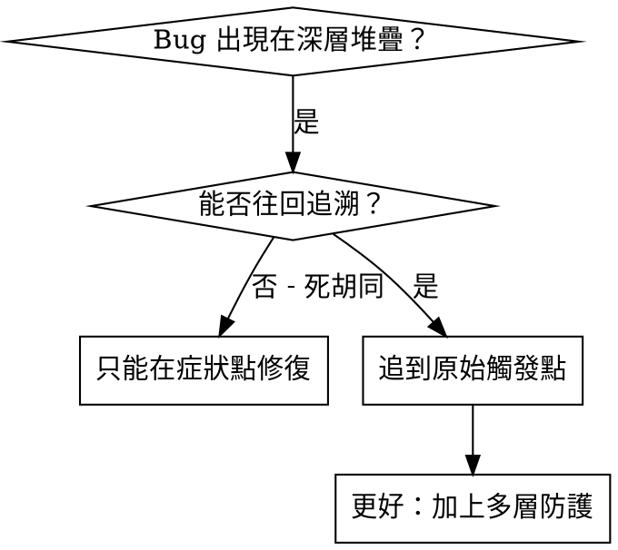
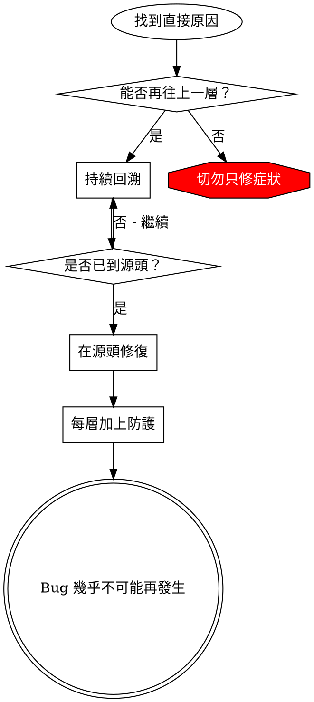

# 根因回溯追蹤

## 概述

Bug 常出現在深層呼叫堆疊（例如在錯的目錄 `git init`、用錯路徑開 DB）。直覺修正出錯點只是在治標。

**核心原則：** 沿著呼叫鏈往回追，找到最初觸發點，從源頭修正。

## 使用時機



**適用情境：**
- 錯誤發生在深層執行流程
- Stack trace 很長
- 不清楚錯誤資料來源
- 需要找出是哪個測試/流程觸發

## 回溯步驟

### 1. 觀察症狀
```
Error: git init failed in /Users/jesse/project/packages/core
```

### 2. 找到直接原因
**哪段程式碼直接造成這個錯誤？**
```typescript
await execFileAsync('git', ['init'], { cwd: projectDir });
```

### 3. 問：是誰呼叫它？
```typescript
WorktreeManager.createSessionWorktree(projectDir, sessionId)
  → called by Session.initializeWorkspace()
  → called by Session.create()
  → called by test at Project.create()
```

### 4. 持續往上追
**傳入的值是什麼？**
- `projectDir = ''`（空字串）
- 空字串作為 `cwd` 會落到 `process.cwd()`
- 結果在錯誤目錄建立 `.git`

### 5. 找到最初觸發點
**空字串從哪裡來？**
```typescript
const context = setupCoreTest(); // Returns { tempDir: '' }
Project.create('name', context.tempDir); // Accessed before beforeEach!
```

## 加入堆疊紀錄（無法手動回溯時）

```typescript
// 在危險操作之前加記錄
async function gitInit(directory: string) {
  const stack = new Error().stack;
  console.error('DEBUG git init:', {
    directory,
    cwd: process.cwd(),
    nodeEnv: process.env.NODE_ENV,
    stack,
  });

  await execFileAsync('git', ['init'], { cwd: directory });
}
```

**關鍵：** 在測試中用 `console.error()`（logger 可能被抑制）

**執行並擷取：**
```bash
npm test 2>&1 | grep 'DEBUG git init'
```

**分析 stack trace：**
- 找出測試檔名
- 定位觸發行號
- 觀察模式（特定測試？特定參數？）

## 不知道是哪個測試污染時

- 先縮小範圍：單檔 → 子資料夾 → 全部
- 一次只跑一個測試，或用二分法縮小範圍
- 如需自動化，使用 `scripts/find-polluter.sh` 逐一執行並在第一次出現污染時停下

範例：
```bash
./scripts/find-polluter.sh .git 'src/**/*.test.ts'
```

## 關鍵原則



**永遠不要只修錯誤出現的位置。**

## 堆疊追蹤小技巧

- **測試中**：用 `console.error()`
- **在操作之前**：不要等失敗後才記錄
- **帶上下文**：目錄、cwd、環境變數、時間
- **保留堆疊**：`new Error().stack` 可看到完整呼叫鏈
