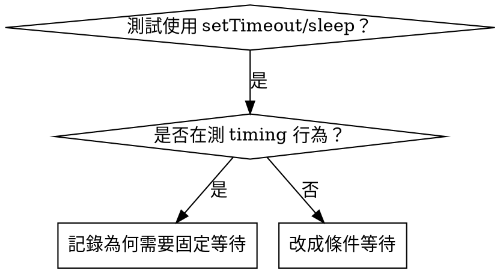

# 以條件為基準的等待（Condition-Based Waiting）

## 概述

測試中常用硬等待（`setTimeout`/`sleep`）猜測時機，容易在不同機器或 CI 下變成 flaky。

**核心原則：** 等待真正的條件成立，而不是等待猜測的時間。

## 使用時機



**適用情境：**
- 測試內有任意延遲（`setTimeout`, `sleep`, `time.sleep()`）
- 測試偶爾失敗（flaky）
- 並行測試時 timeout
- 等待非同步流程完成

**不適用情境：**
- 測試本身就是在驗證時間行為（debounce、throttle）
- 使用固定時間時要寫清楚「為什麼」

## 核心模式

```typescript
// ❌ BEFORE: 猜時間
await new Promise(r => setTimeout(r, 50));
const result = getResult();
expect(result).toBeDefined();

// ✅ AFTER: 等條件
await waitFor(() => getResult() !== undefined, 'result to be ready');
const result = getResult();
expect(result).toBeDefined();
```

## 常見等待條件

| 情境 | 條件寫法 |
|------|----------|
| 等事件 | `waitFor(() => events.find(e => e.type === 'DONE'), 'DONE event')` |
| 等狀態 | `waitFor(() => machine.state === 'ready', 'machine ready')` |
| 等數量 | `waitFor(() => items.length >= 5, 'items >= 5')` |
| 等檔案 | `waitFor(() => fs.existsSync(path), 'file exists')` |
| 複合條件 | `waitFor(() => obj.ready && obj.value > 10, 'ready + value')` |

## 實作範本（輪詢）

```typescript
async function waitFor<T>(
  condition: () => T | undefined | null | false,
  description: string,
  timeoutMs = 5000
): Promise<T> {
  const startTime = Date.now();

  while (true) {
    const result = condition();
    if (result) return result;

    if (Date.now() - startTime > timeoutMs) {
      throw new Error(`Timeout waiting for ${description} after ${timeoutMs}ms`);
    }

    await new Promise(r => setTimeout(r, 10)); // 每 10ms 輪詢
  }
}
```

可直接複製 `references/wait-for-helper.ts` 作為通用 helper。

## 常見錯誤

- **輪詢太快**：`setTimeout(check, 1)` → 浪費 CPU
- **沒有 timeout**：條件永遠不成立會卡死
- **使用舊資料**：迴圈外先讀狀態 → 變成 stale

## 何時固定等待是合理的

```typescript
// 工具每 100ms tick 一次，需要 2 個 tick 才能驗證
await waitForEvent(manager, 'TOOL_STARTED', 5000); // 先等條件
await new Promise(r => setTimeout(r, 200));        // 再等時間
```

**必要條件：**
1. 先等待觸發條件
2. 固定等待是基於已知節奏（不是猜測）
3. 要寫註解或文件說明原因
