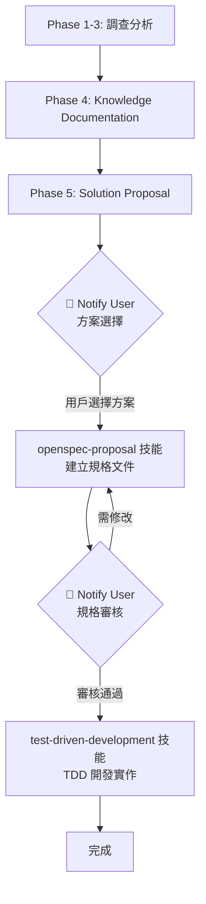

# Bug Investigation Skill

## Overview

A systematic methodology for investigating bugs or feature issues in complex codebases. This skill guides you through:
1. **Problem Discovery** - Understanding the reported issue
2. **Evidence Gathering** - Collecting data from database and logs
3. **Root Cause Analysis** - Tracing data flow to identify the source
4. **Knowledge Documentation** - Recording findings for future reference
5. **Solution Proposal** - Designing and presenting fix options

> [!IMPORTANT]
> **Skill Integration Flow**: This skill integrates with `openspec-proposal` for specification creation and `test-driven-development` for implementation.

## Knowledge Base

調查過程中獲得的程式功能邏輯文件應同步存放在**專案內部**的知識庫資料夾：

```
docs/knowledge/
├── [feature-name]/
│   ├── data-flow.md       # 資料流圖解
│   ├── key-functions.md   # 關鍵函數說明
│   └── related-tables.md  # 相關資料表結構
```

**好處**：
- 知識庫與專案程式碼一同版本控制
- 團隊成員可共享調查結果
- 日後調查類似問題時可先查閱
- 減少重複的 code tracing

**範例參考**：查看 `examples/state-inconsistency-example/` 了解完整的調查案例範例。

## When to Use

Use this skill when:
- A bug report describes unexpected behavior
- There's a discrepancy between expected and actual data
- You need to trace an issue through multiple system layers
- The problem involves data synchronization issues

## How to Activate

觸發此技能的方式：
- 明確提及 "bug investigation" 或 "調查 Bug"
- 描述資料不一致或異常行為問題
- 請求追蹤資料流或分析程式碼
- 使用關鍵詞："investigate", "trace", "root cause"

---

## Tools & Scripts

此技能使用專業工具來加速 Bug 調查工作。腳本位於 `scripts/`

### 必要工具檢查

**首次使用前，請執行工具檢查**:

```bash
cd scripts
./check-tools.sh
```

此腳本會檢查並提供以下工具的安裝指引：

| 工具 | 用途 | 必要性 |
|------|------|--------|
| `ripgrep` (rg) | 程式碼搜尋 - 優化的正規表達式搜尋 | ⭐⭐⭐ 必要 |
| `fd` | 檔案搜尋 - 快速模式比對 | ⭐⭐ 建議 |
| `ast-grep` | 程式結構分析 - AST 層級搜尋 | ⭐⭐ 建議 |
| `jq` | JSON 資料處理 | ⭐ 可選 |
| `yq` | YAML 資料處理 | ⭐ 可選 |

**AI 助手可協助安裝**：如果缺少工具，可請 AI 助手協助安裝以加速調查工作。

### 可用腳本

所有腳本已通用化，不綁定特定表或流程：

| 腳本 | 功能 | 用法範例 |
|------|------|----------|
| `check-tools.sh` | 檢查工具並提供安裝指引 | `./check-tools.sh` |
| `trace-data-flow.sh` | 追蹤任意變數的資料流 | `./trace-data-flow.sh <variable> [path] [types]` |
| `search-database-queries.sh` | 搜尋任意資料表的 SQL 查詢 | `./search-database-queries.sh <table>` |
| `analyze-function-calls.sh` | 分析任意檔案的函數呼叫 | `./analyze-function-calls.sh <file>` |
| `generate-flow-diagram.sh` | 生成任意函數的 Mermaid 流程圖 | `./generate-flow-diagram.sh <func> <file>` |

詳細說明請參考: [scripts/README.md](scripts/README.md)


---

## Phase 1: Problem Discovery

### 1.1 收集初始資訊

向使用者詢問以下資訊：
- [ ] **問題描述**：預期行為與實際行為的差異為何？
- [ ] **樣本資料**：具體的 ID、時間戳記或交易編號
- [ ] **可重現性**：問題是否能穩定重現？
- [ ] **環境資訊**：受影響的環境、系統或資料庫

### 1.2 建立調查文件

在**專案內部**的知識庫目錄中建立 `brainstorming.md`：

```bash
# 建立功能專屬的知識庫目錄
mkdir -p docs/knowledge/[feature-name]
```

**路徑說明**：
- 所有調查文件存放於 `docs/knowledge/[feature-name]/`
- 與專案程式碼一同版本控制，團隊可共享
- 避免使用 AI 工具的 artifacts 目錄（對話結束後無法存取）

建立 `docs/knowledge/[feature-name]/brainstorming.md`：

```markdown
# [Issue Title] Investigation

## Problem Statement
- **Expected**: [Expected behavior]
- **Actual**: [Actual behavior]
- **Sample Data**: [Transaction ID, etc.]

## Investigation Progress
- [ ] Phase 1: Problem Discovery
- [ ] Phase 2: Evidence Gathering
- [ ] Phase 3: Root Cause Analysis
- [ ] Phase 4: Knowledge Documentation
- [ ] Phase 5: Solution Proposal
```

---

## Phase 2: Evidence Gathering

### 2.1 資料庫驗證

產生 SQL 查詢以驗證問題：

```sql
-- Template: Check main transaction
SELECT * FROM [main_table] WHERE [id] = '[sample_id]';

-- Template: Check related records
SELECT * FROM [related_table] WHERE [foreign_key] = '[sample_id]';

-- Template: Check logs
SELECT * FROM [log_table] WHERE [reference] = '[sample_id]';
```

### 2.2 記錄發現

在 `docs/knowledge/[feature-name]/brainstorming.md` 中記錄資料庫證據：

```markdown
## Database Evidence

| Table | Field | Expected | Actual |
|-------|-------|----------|--------|
| [table] | [field] | [expected] | [actual] |
```

### 2.3 識別矛盾點

尋找資料不一致的地方：
- [ ] 相關資料表的資料是否匹配？
- [ ] Log 記錄是否與交易資料一致？
- [ ] 資料中是否有時序問題？

---

## Phase 3: Root Cause Analysis

### 3.1 追蹤資料流向

描繪資料從輸入到資料庫的完整路徑：

```
1. User Action → [Function/API]
           ↓
2. Frontend Processing → [JS Function]
           ↓
3. Backend API → [Controller/Action]
           ↓
4. Database Write → [Table(s)]
```

### 3.2 程式碼調查

對資料流中的每個步驟：

1. **Search for key variables** (使用專業工具):
   ```bash
   # 使用 ripgrep (推薦)
   rg "<variable_name>" --type php --type js
   
   # 或使用技能提供的腳本
   ./scripts/trace-data-flow.sh <variable_name>
   
   # 搜尋資料表操作
   ./scripts/search-database-queries.sh <table_name>
   ```

2. **追蹤資料來源**：
   - 哪個 function 計算或提供此值？
   - 資料如何從前端傳遞到後端？
   - 使用 `analyze-function-calls.sh` 分析 function 呼叫關係

3. **識別分歧點**：
   - 預期與實際行為在哪裡分歧？
   - 什麼條件導致進入錯誤的路徑？
   - 使用 `generate-flow-diagram.sh` 生成流程圖輔助分析

### 3.3 記錄根本原因

更新 `docs/knowledge/[feature-name]/brainstorming.md`：

```markdown
## Root Cause Analysis

### Data Flow
[Diagram or step-by-step flow]

### Problem Location
- **File**: [file path]
- **Line**: [line number]
- **Issue**: [description]

### Why It Happens
[Explanation of the condition that triggers the bug]
```

---

## Phase 4: Knowledge Documentation

> [!NOTE]
> **順序調整說明**：Knowledge Documentation 應在 Solution Proposal 之前完成，
> 因為使用者需要參考完整的調查文件才能對解決方案做出判斷。

### 4.1 檢查現有知識庫

在深入研究程式碼之前，檢查是否已有相關文件：

```bash
# Search knowledge base for related feature
ls docs/knowledge/
```

### 4.2 建立功能知識文件

調查完成後，記錄功能邏輯供未來參考：

```bash
mkdir -p docs/knowledge/[feature-name]
```

Create the following files:

#### `data-flow.md`
```markdown
# [Feature Name] - Data Flow

## Overview
[Brief description of the feature]

## Data Flow Diagram
```
User Action → [Frontend Function] → [Backend API] → [Database Tables]
```

## Key Variables
| Variable | Location | Purpose |
|----------|----------|---------|
| `[var]` | [file:line] | [description] |
```

#### `key-functions.md`
```markdown
# [Feature Name] - Key Functions

## Frontend (JavaScript)
| Function | File | Description |
|----------|------|-------------|
| `[func]()` | [file:line] | [what it does] |

## Backend (PHP)
| Function | File | Description |
|----------|------|-------------|
| `[func]()` | [file:line] | [what it does] |
```

#### `related-tables.md`
```markdown
# [Feature Name] - Database Tables

## Primary Tables
| Table | Key Field | Purpose |
|-------|-----------|---------|
| `[table]` | `[pk]` | [description] |

## Log Tables
| Table | Key Field | Purpose |
|-------|-----------|---------|
| `[table]` | `[pk]` | [description] |
```

### 4.3 更新調查文件

將 Phase 4 完成狀態更新至 `brainstorming.md`：

```markdown
### Phase 4: Knowledge Documentation
- [x] Checked existing knowledge base
- [x] Created/updated feature knowledge documents
- [x] Documented data flow
- [x] Listed key functions with file locations
- [x] Recorded related database tables
```

---

## Phase 5: Solution Proposal

> [!IMPORTANT]
> **Notify User Checkpoint**: 此階段完成方案設計後，必須通知使用者選擇方案。
> 使用者可參考 Phase 4 產生的知識文件做出判斷。

### 5.1 設計解決方案選項

提出 2-3 個解決方案：

| Option | Description | Pros | Cons |
|--------|-------------|------|------|
| A | [Frontend fix] | [...] | [...] |
| B | [Backend fix] | [...] | [...] |
| C | [Combined fix] | [...] | [...] |

### 5.2 推薦解決方案

向使用者呈現建議：
- 推薦哪個選項？為什麼？
- 有什麼風險？
- 需要什麼測試？

### 5.3 🔔 Notify User - 方案選擇

**此時必須執行 `notify_user` 通知使用者**，內容包含：
- 調查摘要（連結至 `docs/knowledge/[feature-name]/brainstorming.md`）
- 解決方案選項表格
- 推薦方案及理由
- 請求使用者選擇方案

```markdown
## 調查完成 - 請選擇解決方案

### 調查文件
- [brainstorming.md](docs/knowledge/[feature-name]/brainstorming.md)
- [data-flow.md](docs/knowledge/[feature-name]/data-flow.md)

### 解決方案選項
| Option | Description | Recommendation |
|--------|-------------|----------------|
| A | ... | |
| B | ... | ⭐ 推薦 |

請選擇您希望採用的方案（A/B/C）。
```

### 5.4 建立 OpenSpec Proposal

**使用者選擇方案後**，使用 `openspec-proposal` 技能建立規格文件：

```bash
# 觸發 openspec-proposal 技能
# 依據選定的方案建立 proposal
mkdir -p openspec/changes/[YYYY-MM-DD]-[fix-description]
```

Include:
- `proposal.md` - Problem analysis and solution
- `tasks.md` - Implementation checklist
- `specs/[capability]/spec.md` - Specification changes

### 5.5 🔔 Notify User - 規格審核

**OpenSpec Proposal 建立完成後**，再次執行 `notify_user`：

```markdown
## OpenSpec Proposal 已建立 - 請審核

### 規格文件
- [proposal.md](openspec/changes/[YYYY-MM-DD]-[fix-description]/proposal.md)
- [tasks.md](openspec/changes/[YYYY-MM-DD]-[fix-description]/tasks.md)

請審核以上規格文件，審核通過後將進入 TDD 開發階段。
```

### 5.6 執行 TDD 開發

**規格審核通過後**，使用 `test-driven-development` 技能進行開發：

1. 依據 `tasks.md` 建立測試案例
2. 執行 Red-Green-Refactor 循環
3. 驗證修復不會引入新問題

---

## Skill Integration Workflow

> [!TIP]
> 此技能與其他技能的串接流程圖：



### 關鍵檢查點

| 階段 | 動作 | 產出 |
|------|------|------|
| Phase 4 完成後 | 自動進入 Phase 5 | `docs/knowledge/[feature-name]/` 文件 |
| Phase 5.2 完成後 | 🔔 `notify_user` | 方案選項，等待用戶選擇 |
| Phase 5.4 完成後 | 🔔 `notify_user` | OpenSpec Proposal，等待審核 |
| 審核通過後 | 切換至 TDD 技能 | 依規格進行開發 |

---

## 關鍵原則

### 調查方法論
- **追隨資料** - 從來源追蹤數值到目的地
- **信任證據** - 資料庫記錄不會說謊
- **一次一個假設** - 先測試和驗證再前進
- **記錄一切** - 保留調查軌跡

### 溝通方式
- **游進式報告** - 不要等到最後才報告
- **提出澄清問題** - 與使用者驗證假設
- **解釋推理** - 幫助使用者理解分析

### 解決方案設計
- **最小變更原則** - 只修復損壞的部分
- **預防未來問題** - 考慮如何避免類似的 bug
- **完整測試** - 驗證修復不會引入新問題

---

## 檢查清單總結

完整的調查檢查清單請參考：**[references/checklist.md](references/checklist.md)**

該文件包含所有五個階段的詳細檢查項目，適合在調查過程中作為參考。

