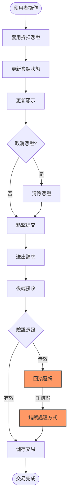

# 狀態不一致調查範例

> **範例目的**: 本文件示範如何應用 5 階段調查方法論來追蹤資料流並找出狀態不一致的根因。
> 雖然範例使用交易處理場景，但**相同方法可應用於任何系統**的狀態管理問題。

## 問題描述

在交易處理流程中，折扣憑證在應用後價格已反映折扣，但在最終提交時憑證狀態變為無效，導致交易紀錄中出現錯誤的處理方式資訊。

### 重現步驟

1. 在介面上選擇項目
2. 在提交前套用折扣憑證
3. 確認價格已套用折扣
4. 點擊提交
5. 選擇處理方式 A
6. 完成交易

### 預期結果

- 折扣憑證應正確套用
- 處理方式應為「方式 A」
- 交易紀錄應反映實際折扣金額

### 實際結果

- 憑證狀態變為無效
- 後端收到的處理方式為「方式 B」
- 最終金額與預期不符

## 調查範圍

### 涉及的元件

- **前端**: 
  - `js/transaction.js` - 交易處理流程
  - `js/discount.js` - 折扣憑證管理
- **後端**:
  - `Controller/TransactionController.php`
  - `Service/DiscountService.php`
  - `Repository/DiscountRepository.php`

### 資料流追蹤範圍

從憑證套用 → 價格計算 → 提交請求 → 後端驗證 → 交易儲存

## 調查過程

### 階段 1: 前端資料流

#### 1.1 憑證套用
**位置**: `js/discount.js:applyDiscount()`

```javascript
function applyDiscount(discountCode) {
    // 驗證憑證
    const discount = validateDiscount(discountCode);
    
    // 計算折扣
    const amount = calculateDiscount(discount, session.total);
    
    // 更新會話狀態
    session.appliedDiscount = discount;
    session.discountAmount = amount;
    session.total = session.total - amount;
    
    // 更新 UI
    updateDisplay();
}
```

**問題發現**: ✅ 此階段正常，憑證正確套用

#### 1.2 提交觸發
**位置**: `js/transaction.js:processTransaction()`

```javascript
function processTransaction(processingMethod) {
    const transactionData = {
        items: session.items,
        total: session.total,
        discount: session.appliedDiscount,  // 🔴 問題點
        processingMethod: processingMethod
    };
    
    // 送出請求
    sendRequest(transactionData);
}
```

**問題發現**: 🔴 當使用者取消憑證後，`session.appliedDiscount` 可能仍保留舊值

### 階段 2: 後端資料流

#### 2.1 接收請求
**位置**: `Controller/TransactionController.php:processTransaction()`

```php
public function processTransaction() {
    $request = $this->getRequest();
    
    $discount = $request['discount'] ?? null;
    $processingMethod = $request['processingMethod'];
    
    // 驗證憑證
    if ($discount) {
        $isValid = $this->discountService->validate($discount);
        if (!$isValid) {
            // 🔴 問題點：回滾邏輯不完整
            $processingMethod = 'methodB'; // 錯誤的預設值
        }
    }
    
    // 儲存交易
    $this->saveTransaction($processingMethod);
}
```

**問題發現**: 🔴 當憑證無效時，錯誤地將處理方式改為 'methodB'

## 資料流向圖



## 根因分析

### 根本原因

1. **前端狀態管理不完整**: 取消憑證時，未正確清除 `session.appliedDiscount`
2. **後端回滾邏輯錯誤**: 當憑證驗證失敗時，錯誤地修改了處理方式
3. **缺少防禦性驗證**: 後端未檢查處理方式的一致性

### 影響範圍

- 使用者體驗受損
- 交易資料不準確
- 可能影響下游系統

## 解決方案

### 方案 1: 修復前端狀態清除

```javascript
function cancelDiscount() {
    session.appliedDiscount = null;  // 明確設為 null
    session.discountAmount = 0;
    session.total = calculateOriginalTotal();
    updateDisplay();
}
```

### 方案 2: 修復後端回滾邏輯

```php
public function processTransaction() {
    $request = $this->getRequest();
    
    $discount = $request['discount'] ?? null;
    $processingMethod = $request['processingMethod'];
    
    if ($discount) {
        $isValid = $this->discountService->validate($discount);
        if (!$isValid) {
            // 拋出異常，要求重新選擇
            throw new DiscountInvalidException('憑證已失效，請重新選擇處理方式');
        }
    }
    
    // 儲存交易
    $this->saveTransaction($processingMethod);
}
```

### 方案 3: 增強驗證機制

```php
private function validateProcessingConsistency($discount, $processingMethod) {
    if ($discount && $processingMethod === 'methodB') {
        throw new InvalidArgumentException('處理方式與憑證衝突');
    }
    
    if (!$discount && $processingMethod === 'methodB') {
        throw new InvalidArgumentException('未套用憑證但處理方式為 methodB');
    }
}
```

## 測試計畫

### 單元測試

- [ ] 測試憑證套用和取消
- [ ] 測試後端憑證驗證
- [ ] 測試處理方式驗證

### 整合測試

- [ ] 測試完整的交易流程
- [ ] 測試憑證失效時的錯誤處理
- [ ] 測試各種處理方式組合

### 手動測試

- [ ] 重現原問題步驟
- [ ] 驗證修復後的行為
- [ ] 測試邊界情況

## 經驗總結

### 學到的教訓

1. 狀態變更要同步且完整
2. 後端不應假設前端資料的正確性
3. 錯誤處理應明確且可追蹤
4. 關鍵流程需要完整的整合測試

### 預防措施

1. 實作狀態管理 library（如 Redux、Vuex）
2. 建立完整的 E2E 測試
3. 增強後端資料驗證
4. 添加交易日誌記錄

## 相關資源

- [功能系統架構文件](docs/architecture/feature-system.md)
- [流程圖](docs/diagrams/feature-flow.mmd)
- Issue Tracker: #[ISSUE_NUMBER]

---

## 💡 方法論遷移指引

此範例使用的調查方法可直接應用於其他場景：

### 適用場景

- ✅ 任何涉及狀態同步的問題
- ✅ 前後端資料不一致
- ✅ 會話管理 bug
- ✅ 快取失效問題
- ✅ 分散式系統狀態不一致

### 遷移步驟

1. **識別狀態點** - 找出系統中的狀態儲存位置（本例：前端 session、後端資料庫）
2. **追蹤資料流** - 使用相同的階段劃分方式
3. **繪製流向圖** - 用 Mermaid 視覺化狀態轉換
4. **定位分歧點** - 找出預期與實際行為的分歧處
5. **多方案設計** - 提出 2-3 個解決方案供選擇
